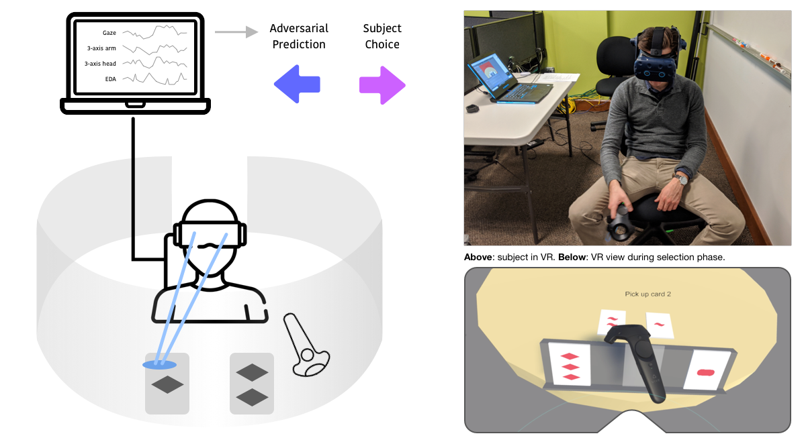

# Covert Embodied Choice

Unity code for CEC VR experimental setup.

### Paper

*Covert Embodied Choice: Decision-Making, VR, and the Limits of Privacy Under Biometric Surveillance* by Jeremy Gordon, Max Curran, Coye Cheshire, and John Chuang to be presented at CHI 2021.

## Dependencies

Tested with:

- Steam VR Plugin (2.2.0 or 2.5.0)
- Unity editor (2019.3.0f6)
- Steam VR 1.9.16
- Unity Hub 2.2.2